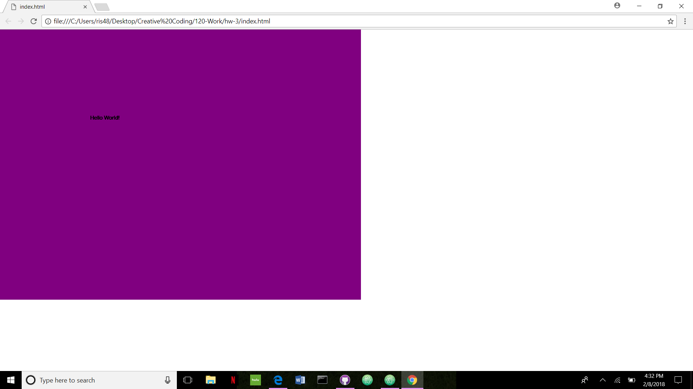

Marissa Koke

["Hello World!" Sketch](https://marissakoke.github.io/120-Work/hw-3/)

### HW-3 Response

This week was very interesting to me. I found everything to be quite easy, and having the [p5.js reference](https://p5js.org/reference/), and videos, were very helpful as well. I am definitely going to enjoy using more of p5 throughout the rest of the course.

I didn't have any problems with this assignment, because the videos that were posted were very helpful, and took you step by step on how to complete the task. I was able to follow along with them which made it easier.

### Final Sketch

This is my final sketch.

